# BusinessTripManager (Lightning)

Small app "Business Trip Manager" for Salesforce, on Lightning.

###  Quick start:  

1. On org: go to **Setup** -> **Domain Management** -> **My Domain** -> **Register Domain**  
2. On the command line: `sfdx force:auth:web:login` -> **login in target org**.  
3. On the command line: `sfdx force:mdapi:deploy -d c:\BusinessTripManager-lightning\src -u your@orglogin.com --testlevel RunAllTestsInOrg`.  
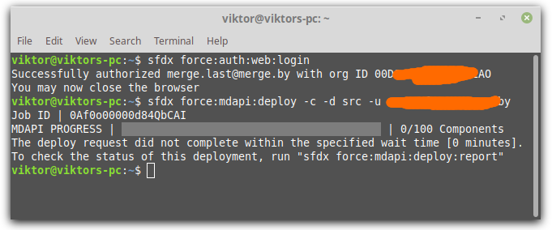  
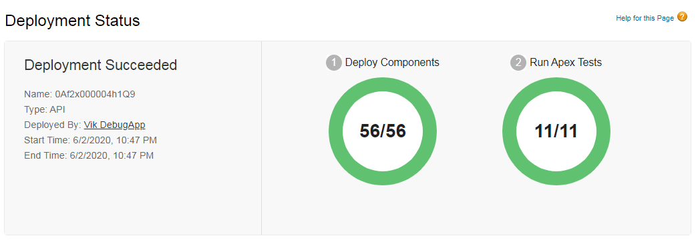  
4. On org: **Setup** -> **Profiles** -> **System Administrator** -> **Edit** -> **Tab Settings** -> **Custom Tab Settings** -> **[Business Trip Manager]** -> **Default On**  
5. On org: **Setup** -> **Profiles** -> **System Administrator** -> **Field-Level Security** -> **Custom Field-Level Security** -> **[Business Trip]** -> **add edit access for custom fields**  
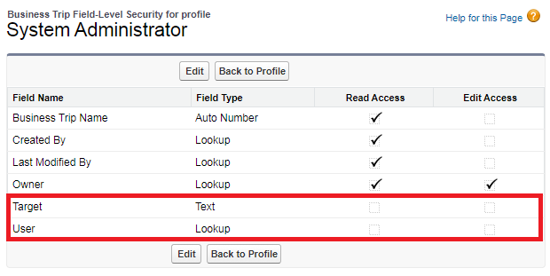  
6. On org: **Setup** -> **Profiles** -> **System Administrator** -> **Field-Level Security** -> **Custom Field-Level Security** -> **[Ride]** -> **add edit access for custom fields**  
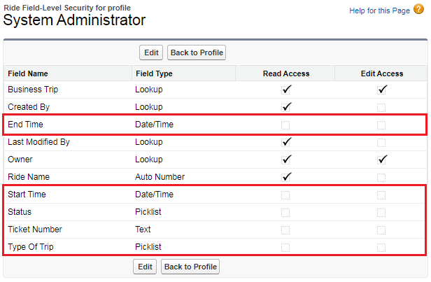  
7. On org: **Switch to Lightning Experience**  
8. On org: **Go to App Launcher** -> **All Items** -> **[Business Trip Manager]**  
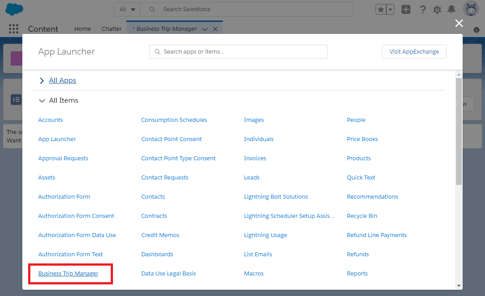  
  
###  Data-model:  

Just 2 custom objects:
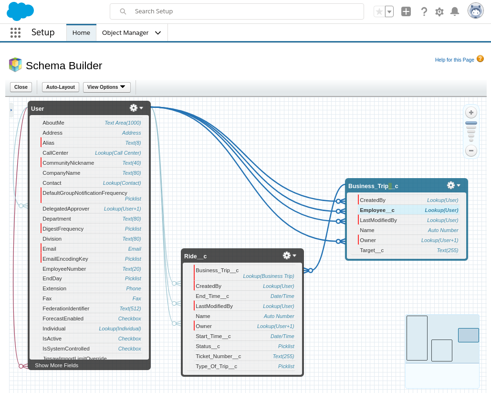

###  Screenshots of the application:

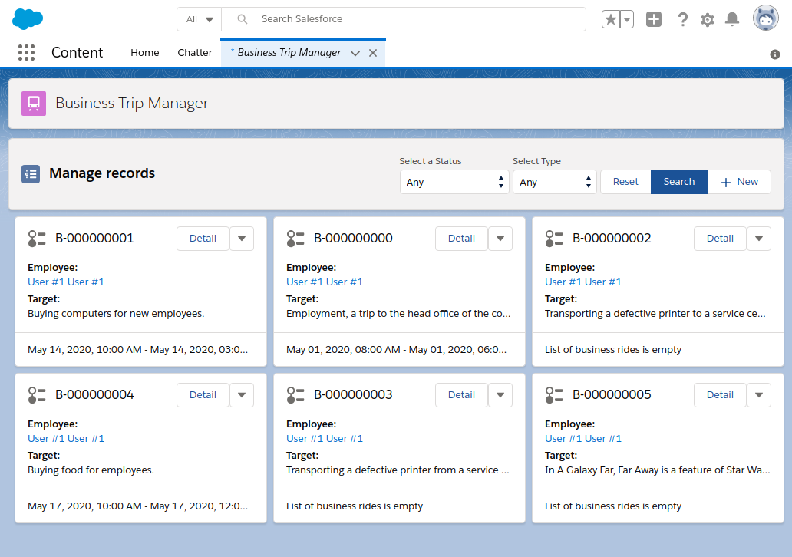  

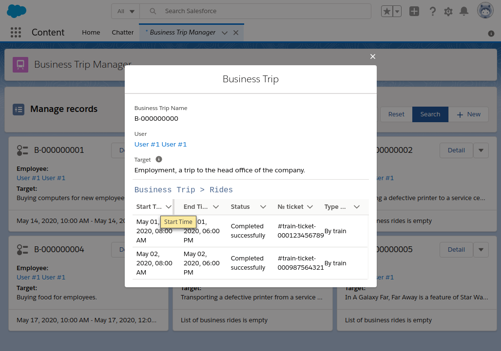  

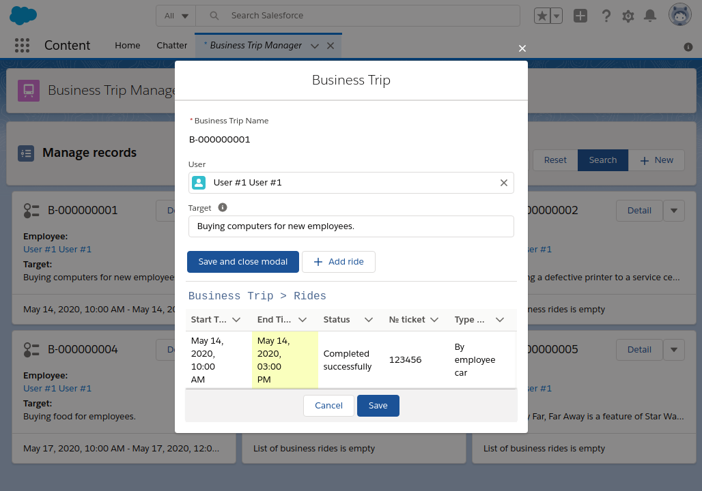  

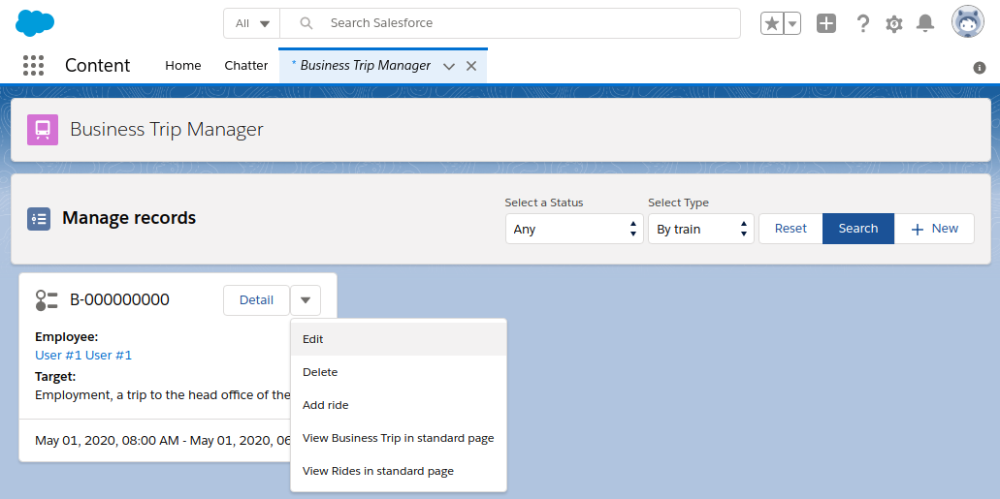  

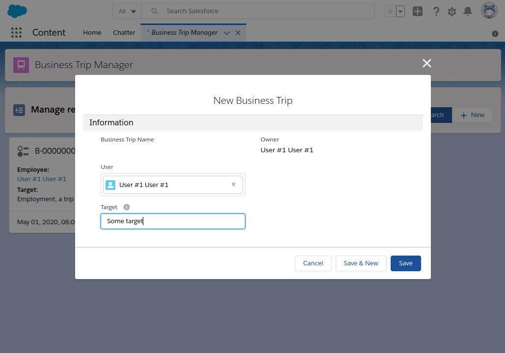  

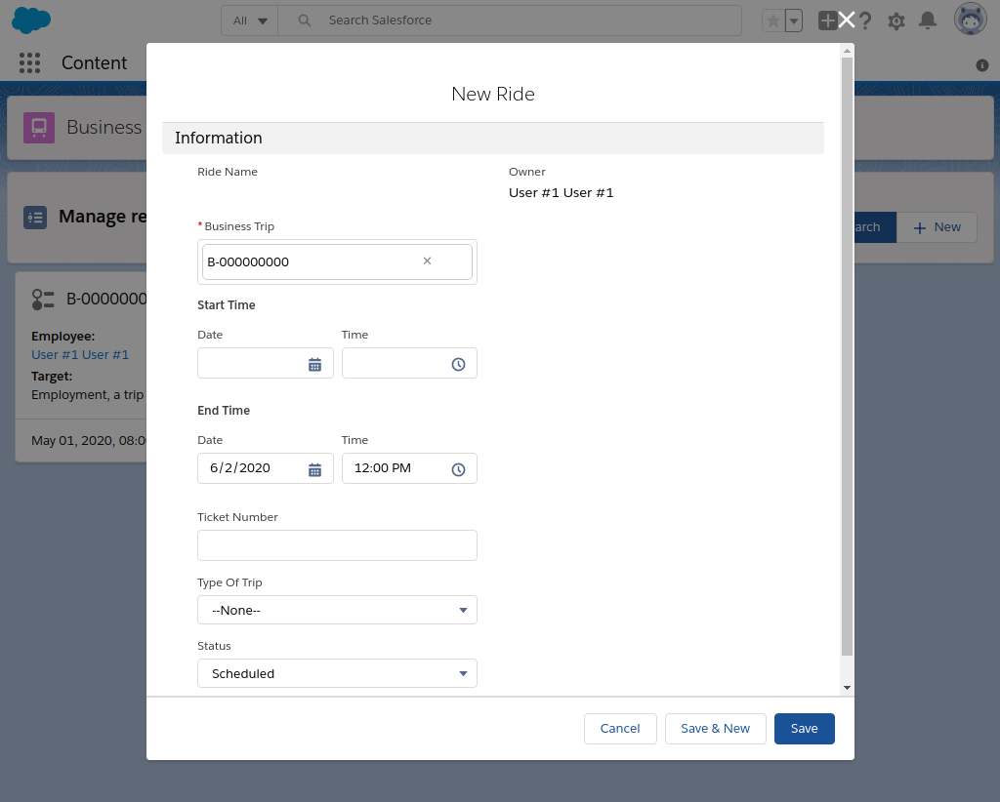  

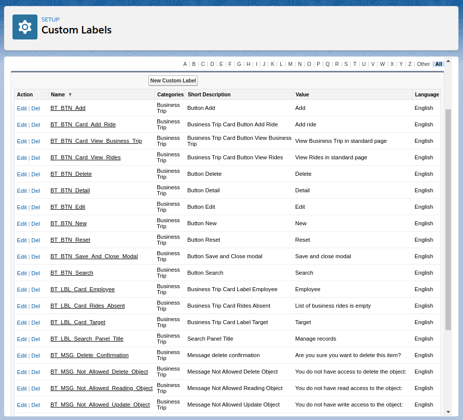  

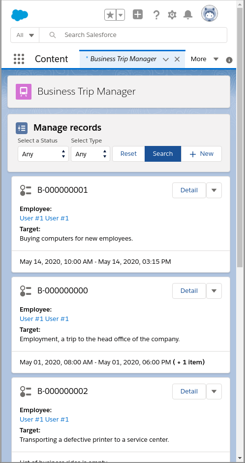  
